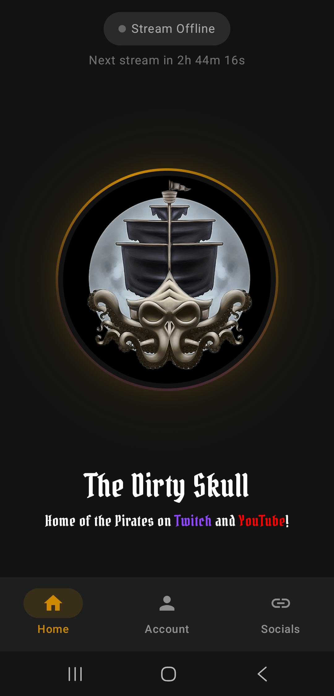
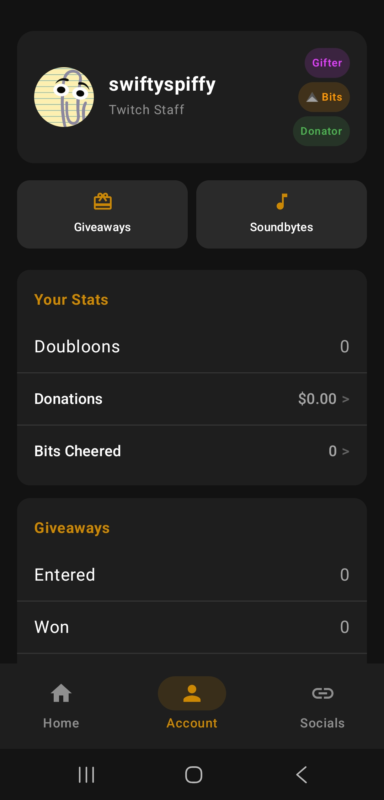
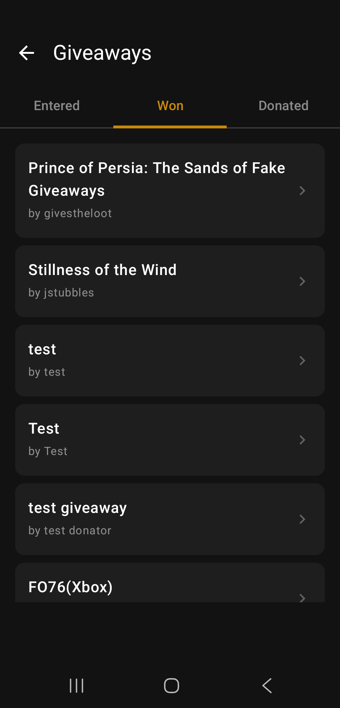
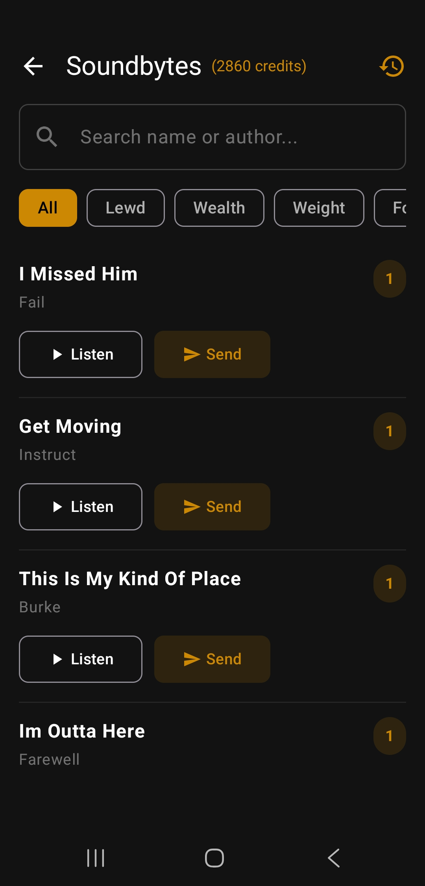
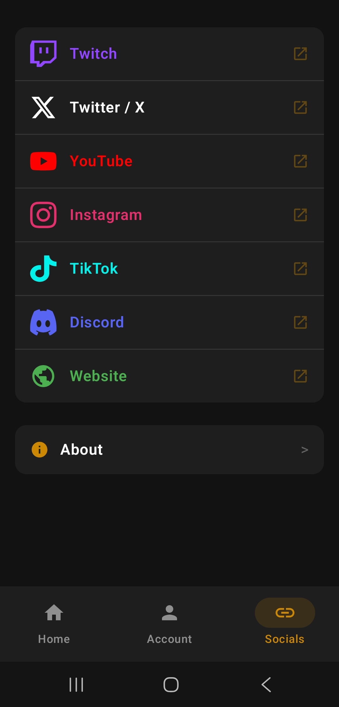
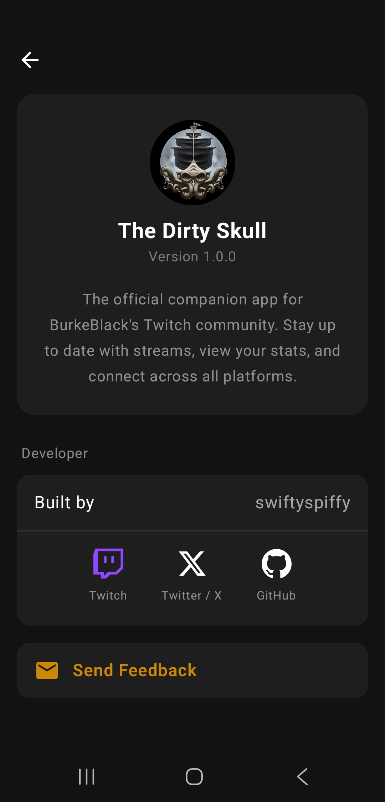

<p align="center">
  
</p>

<h1 align="center">The Dirty Skull</h1>

<p align="center">
  The official companion app for <a href="https://twitch.tv/burkeblack">BurkeBlack's</a> Twitch community.
</p>

<p align="center">
  <a href="https://play.google.com/store/apps/details?id=com.swiftyspiffy.burkeblackapp">
    
  </a>
  &nbsp;&nbsp;
  <a href="https://apps.apple.com/us/app/dirty-skull/id6761034588">
    
  </a>
</p>

<p align="center">
  <a href="https://burkeblack.tv/app/android/">Website</a> &middot;
  <a href="https://github.com/swiftyspiffy/BurkeBlackApp-iOS">iOS Repo</a> &middot;
  <a href="https://discord.gg/burkeblack">Discord</a> &middot;
  <a href="https://twitch.tv/burkeblack">Twitch</a>
</p>

---

## What Is This?

**The Dirty Skull** is the official mobile app for [BurkeBlack](https://twitch.tv/burkeblack), a full-time variety streamer on Twitch. It gives his community - The Pirates - a way to stay connected to the stream, participate in events, and manage community features, all from their phone.

Whether you're a long-time crew member or a new viewer, the app gives you everything you need at your fingertips.

## Screenshots

<p align="center">
  
  
  
  
</p>
<p align="center">
  
  
</p>

## Features

- **Live Stream Status** - see when BurkeBlack is live with real-time viewer counts, or check the countdown to the next stream. Tap to jump straight to Twitch.
- **Real-Time Giveaways** - enter giveaways directly from the app as they happen on stream. Track everything you've entered, won, and donated in one place.
- **Soundbytes** - browse, preview, and send soundbytes to the stream. Filter by genre, search by name, and track your credits and send history.
- **Captain's Quarters** - your personal dashboard with doubloons, donations, bits cheered, subscription details, giveaway history, and achievement badges.
- **Tidings** - stay up to date with community news and announcements straight from the Captain and his officers.
- **The Crew** - vote on monthly Twitch clips, browse community game servers, explore emotes and badges, and check The Late Shift team status.
- **Ports** - latest YouTube videos, Shorts, TikToks, and X posts all in one feed.
- **Mod Panel** - moderators get a full toolkit: quick actions, viewer lookup, chat commands, timed messages, giveaway and soundbyte management, and more.

## Download

The app is available for free on [Google Play](https://play.google.com/store/apps/details?id=com.swiftyspiffy.burkeblackapp) and the [App Store](https://apps.apple.com/us/app/dirty-skull/id6761034588).

Having trouble? Use the in-app feedback form (**Account > Send Feedback**) to report issues and include diagnostics.

---

## Contributing

Interested in contributing? Great! Here's how to get started.

This is the **Android** repository. The iOS app lives at [BurkeBlackApp-iOS](https://github.com/swiftyspiffy/BurkeBlackApp-iOS).

### Requirements

- Android Studio Hedgehog or later
- JDK 17+
- Android SDK 35
- Min SDK 26 (Android 8.0)

### Getting Started

```bash
# Clone the repo
git clone https://github.com/swiftyspiffy/BurkeBlackApp-Android.git
cd BurkeBlackAppAndroid

# Open in Android Studio and sync Gradle
```

> **Note:** The app communicates with `api.burkeblack.tv` for backend data. Public endpoints (stream status, home data) work without authentication. Features like giveaways, soundbytes, and account stats require a Twitch login.

### Architecture

- **Kotlin** - 100% Kotlin with coroutines and StateFlow
- **Jetpack Compose** - fully native UI with Material3
- **MVVM** - ViewModels manage state with StateFlow
- **Retrofit** - REST client with Kotlinx Serialization
- **WebSocket** - OkHttp WebSocket for real-time giveaway events with auto-reconnect
- **Coil** - image loading
- **DataStore** - session persistence
- **Authentication** - Twitch OAuth via Chrome Custom Tabs with backend token exchange

### Project Structure

```
app/src/main/java/com/swiftyspiffy/burkeblackapp/
├── auth/                    # OAuth, session management
├── data/
│   ├── api/                 # Retrofit API client + endpoints
│   ├── models/              # Data models
│   └── websocket/           # Giveaway WebSocket
├── navigation/              # Route definitions
├── ui/
│   ├── components/          # Shared composables
│   ├── screens/             # All app screens + ViewModels
│   │   └── mod/             # Mod panel screens
│   └── theme/               # Colors, typography, theme
├── util/                    # Logging utilities
├── BurkeBlackApplication.kt
└── MainActivity.kt
```

### How to Contribute

1. Fork the repository
2. Create a feature branch (`git checkout -b feature/your-feature`)
3. Make your changes
4. Submit a pull request with a clear description of what you changed and why

For bug reports or feature requests, please [open an issue](https://github.com/swiftyspiffy/BurkeBlackApp-Android/issues).

---

## Developer

Built by [swiftyspiffy](https://github.com/swiftyspiffy) for the BurkeBlack community.

[Twitch](https://twitch.tv/swiftyspiffy) · [Twitter / X](https://twitter.com/swiftyspiffy) · [GitHub](https://github.com/swiftyspiffy)
